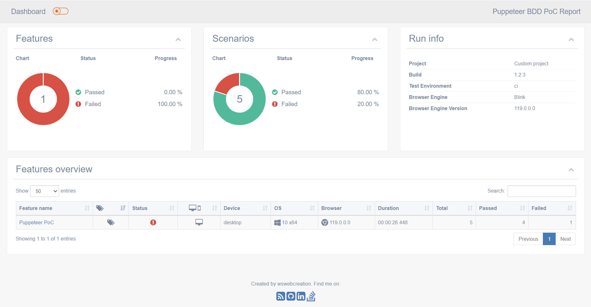
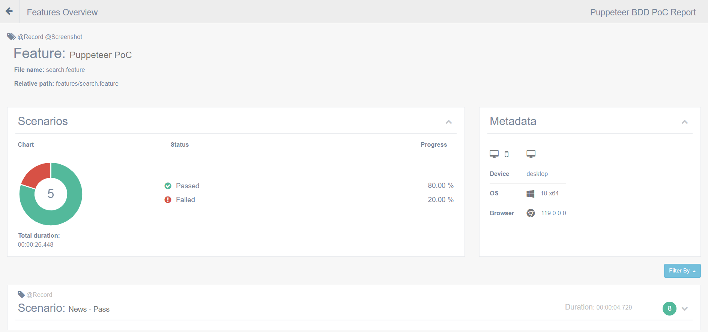
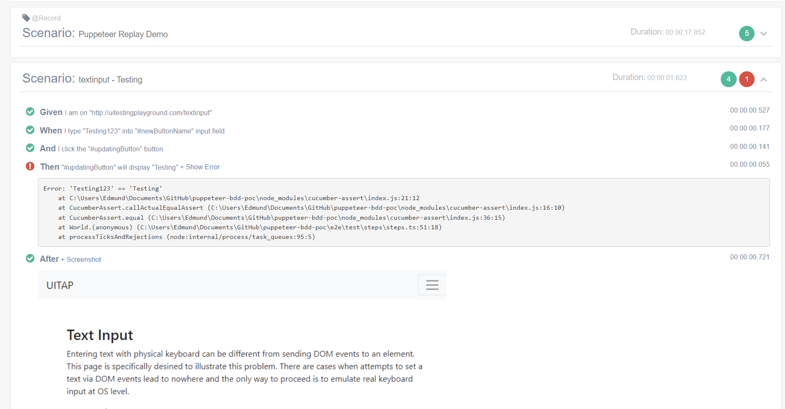
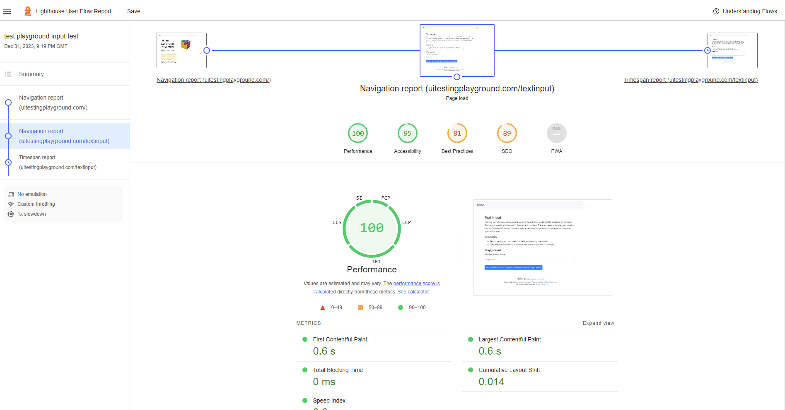
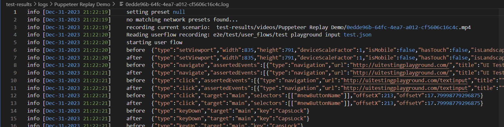

# Puppeteer BDD PoC

BDD wrapper for Puppeteer

**Table of contents:**
- [Features](#features)
  - [Test Reports](#test-reports)
  - [Environment specific configs](#env)
  - [Re-run Failed Tests](#re-run)
  - [Recording a test](#recording)
  - [Taking a Screenshot](#screenshot)
  - [Generating a Lighthouse Report](#lighthouse)
  - [Network Speed Presets](#network-presets)
  - [Test Logs](#test-logs)
  - [CI-CD Test Report](#ci-cd)
  - [Parallel Test Execution](#parallel-execution)
- [Installation](#installation)
- [GitLab-CI Docker Image](#gitlab-ci-image)
- [Running Tests](#running-tests)
- [Roadmap](#roadmap)
- [Reference Docs](#reference-docs)

## Installation <a id="installation"></a>

Install Typescript
```bash
npm install --global typescript
```

> Note: You can run `npm install --global typescript@x.x.x` replacing the x with a verison number to install a specific version of Typescript.

To verify the installation, run the following command:
```bash
tsc -v
```

Install project with npm

```bash
npm install
```

## GitLab-CI Docker Image <a id="gitlab-ci-image"></a>

This Dockerfile can be used to create a self-contained image for running Puppeteer tests in GitLab runners


```docker
FROM node:20-alpine

# Installs latest Chromium (121) package.
RUN apk add --no-cache \
      chromium \
      nss \
      freetype \
      harfbuzz \
      ca-certificates \
      ttf-freefont \
      yarn

# Tell Puppeteer to skip installing Chrome
# launch puppeteer with: browser.launch({executablePath: '/usr/bin/chromium-browser'})
ENV PUPPETEER_SKIP_DOWNLOAD true

# Puppeteer v21.9.0 works with Chromium 121.
RUN yarn add puppeteer@21.9.0

# Add user so we don't need --no-sandbox.
RUN addgroup -S pptruser && adduser -S -G pptruser pptruser \
    && mkdir -p /home/pptruser/Downloads /app \
    && chown -R pptruser:pptruser /home/pptruser \
    && chown -R pptruser:pptruser /app

# Run everything after as non-privileged user.
USER pptruser

CMD echo "Image for Gitlab CI automated testing" && node
```

> Note: Set the Puppeteer executablePath to `/usr/bin/chromium-browser`
    
## Running Tests <a id="running-tests"></a>

To run tests, run the following command

```bash
npm test
```
Retry failed tests
```bash
npm run test:failed
```

Run cleanup script
```
npm run cleanup
```

## Features  <a id="features"></a>

### Test reports  <a id="test-reports"></a>

The default cucumber report is stored in the `cucumber` directory. A custom report with search, system info and other metrics is accessible from `test-results\html-report`



> Note: The report includes a dark mode toggle, for those who like dark mode.



Screenshots created by the `@Screenshot` tag are embedded in the report, under the relevant scenarios. Also embedded is the stack trace from failing step definitions and a screenshot at the point of failure.



> Note: You can modify the information embedded in the custom report at `e2e/helper/extensions/report.ts`

### Environment specific configs  <a id="env"></a>

The project comes with two environment profiles found at `e2e\helper\env`. You can create your environment profile using the following file naming convention `.env.{name}`

> Note: When adding a new environment variable, make sure to update the type definition at `e2e\helper\types\env.d.ts`

```ts
declare global {
    namespace NodeJS {
        interface ProcessEnv {
            ENV: "local" | "dev" | "uat" | "nft" | "ci"
            BASE_URL: string,
            LAUNCH_OPTIONS: string
            RECORD_ALL: "false" | "true"
        }
    }
}
```

env variables can accessed in the code using `process.env.<env-name>`

### Re-run Failed Tests  <a id="re-run"></a>

When `npm test` is triggered a log file is created documenting any failing scenarios. By default, cucumber-js will retry the failed tests once. You can configure the re-try behaviour in the `cucumber.json` file.

> Note: The list of failed tests can be found at `test-results\@rerun.txt`. You can manually trigger a re-run using the command below
>
> ```bash
> npm test:failed
> ```
> [click here](https://github.com/cucumber/cucumber-js/blob/main/docs/rerun.md) to read more about test re-runs


### Recording a test  <a id="recording"></a>

Recording a test is as simple as adding the `@Record` tag to a feature or scenario in your feature files.

The recordings are saved to the `.\test-results\videos\{scenarioName}` directory.

> Note: setting the `RECORD_ALL` environment variable to `"true"` in your `.env` file will trigger a recording of all tests in your feature files.

> Note: The video recorder can be configured by modifying the `config` JSON object in `e2e\helper\extensions\screen-recorder.ts`.

### Taking a Screenshot  <a id="screenshot"></a>

By default, a screenshot is taken when a test fails, at the point of failure. Adding a `@Screenshot` tag to a feature or scenario in your feature files will create a screenshot between step execution.

The screenshots are saved to the `.\test-results\screenshots\{scenarioName}\{sessionId}` directory.

> Note: `sessionId` is a UUID generated by cucumber-js for each test run.

### Generating a Lighthouse Report  <a id="lighthouse"></a>

> Note: Puppeteer JSON recording is required to generate a Lighouse User Flow Report. The JSON file should be stored at `e2e\test\user_flows`

In your scenario, add the step-def below to generate a Lighthouse report

```feature
And I generate a Lighthouse User Flow report from "<filename>"
```



> Note: `filename` should exclude the `e2e\test\user_flows` base path.

> Important: The Lighthouse report is stored in the following directory `test-results\lighthouse\Puppeteer Replay Demo` for both HTML and JSON reports. [Click here](https://github.com/GoogleChrome/lighthouse/blob/main/docs/user-flows.md) to read about Lighthouse reports

### Network Speed Presets  <a id="network-presets"></a>

Should you need to simulate network performance in your test. You use a selection of Network Presets by adding the custom tags below to your scenario or feature.

> Note: The first custom tag will be used, you cannot daisy chain custom tags.

```ts
/**
 * @param download: Simulated download speed (bytes/s)
 * @param latency: Simulated latency (ms)
 * @param upload: Simulated upload speed (bytes/s)
 * @param latency: Simulated latency (ms)
 */
```

| Tag         | Values                                                    |
|------------ |---------------------------------------------------------- |
| @Regular3G  | { "download": 96000, "upload": 32000, "latency": 100 }    |
| @Good3G     | { "download": 196608, "upload": 96000, "latency": 40 }    |
| @Regular4G  | { "download": 524288, "upload": 393216, "latency": 20 }   |
| @DSL        | { "download": 262144, "upload": 131072, "latency": 5 }    |
| @WiFI       | { "download": 3932160, "upload": 1966080, "latency": 2 }  |

> Note: You can add additional presets by editing the `presets` JSON object at `e2e\helper\extensions\network.ts`

### Test Logs  <a id="test-logs"></a>

This project uses the [Winston Logging library](https://github.com/winstonjs/winston/blob/master/docs/transports.md#file-transport) for log processing. Logs for a test run can be found in the following directory `test-results\logs\{scenarioName}`



> Note: You can modify the logging config at `e2e\helper\extensions\logger.ts`

### CI-CD Test Report  <a id="ci-cd"></a>

A JUnit-compatible report is generated by the `posttest` script. using the data from `cucumber\report.json` file. This shows the test summary for each feature file and can be surfaced in a CI job report, as part of your CI-CD pipeline.

> Note: You can access the XML file at `test-results\cucumber-report-junit.xml`

### Parallel Test Execution <a id="parallel-execution"></a>

Number of parallel workers can be configured by updating the `parallel` property in the `cucumber.json` config file. The default value is 4.

> Note: [Click here](https://github.com/cucumber/cucumber-js/blob/main/docs/parallel.md) to read about cucumber-js parallel execution. The number of workers can be configured via the CLI as well.

## Roadmap  <a id="roadmap"></a>

- PDF report generation
- Device Emulation
- CPU Throttling
- Cross Browser Testing (in progress)
- Add more integrations

## Reference Docs  <a id="reference-docs"></a>

[Puppeteer](https://pptr.dev/)

[Winston Logging](https://github.com/winstonjs/winston/blob/master/docs/transports.md#file-transport)

[Cucumber-js](https://github.com/cucumber/cucumber-js/tree/main/docs)
